<div align="center">
  
  
  # Amortia
  
  ### A Pure Functional Language for the BEAM VM
  
  [](https://opensource.org/licenses/MIT)
  [](https://www.haskell.org/)
  
  *Elegance meets the power of the BEAM*
</div>

---

## What is Amortia?

Amortia is a pure functional programming language designed to compile to the BEAM VM. It combines Haskell and Lisp syntax with the battle-tested concurrency and fault-tolerance of Erlang's virtual machine.

**Current Status:** Parser & AST Visualizer
The compiler pipeline is under active development. Right now, you can parse Amortia code, generate AST in JSON format, and explore it with an interactive hot-reloading visualizer.

### Compilation Pipeline

```mermaid
graph LR
    A[Amortia Source] -->|Parser ✅| B[AST]
    B -->|Compiler 🚧| C[Erlang]
    C -->|erlc| D[Core Erlang]
    D -->|beam_asm| E[BEAM Bytecode]
    
    style A fill:#c586c0
    style B fill:#4ec9b0
    style E fill:#ce9178
```



---

## Quick Start

### Installation

```bash
git clone https://github.com/yourusername/amortia.git
cd amortia
make release
sudo make install  # optional
```

### Example

Create a file `example.amor`:

```haskell
defn last :: [a] -> a {
  "Returns the last element of a list.
Raises badarg error if the list is empty."
    [] -> error badarg
    [x] -> x
    [_|xs] -> last xs
}
```

### Usage

```bash
# Watch mode with hot reloading
amortia --watch example.amor

# Visualize once
amortia --visualize example.amor

# Export to JSON
amortia --json example.amor output.json
```

---

## 📖 Language Features

### Pattern Matching

```haskell
defn length :: [a] -> a {
  "Calculate the length of a list"
    [] -> 0
    [_|xs] -> 1 + length xs
}
```

| Pattern  | Description      |
|----------|------------------|
| `x`      | Variable binding |
| `_`      | Wildcard         |
| `[]`     | Empty list       |
| `[x|xs]` | Head and tail    |
| `42`     | Literal match    |

### Type System

Hindley-Milner style with parametric polymorphism:

```haskell
defn map :: (a -> b) -> [a] -> [b] {
  "Apply a function to each element of a list"
    f [] -> []
    f [x|xs] -> [f x | map f xs]
}
```

---

## AST Visualizer

The interactive visualizer provides:
- Side-by-side source code and AST tree view
- Syntax highlighting
- Hot reloading - changes reflect instantly
- Collapsible tree nodes
- JSON export toggle

```bash
amortia --watch mycode.amor
```

---

## Development

### Building

```bash
make          # Development build
make release  # Optimized build
make clean    # Clean artifacts
```

### Project Structure

```
amortia/
├── Parser.hs          # Megaparsec-based parser
├── Main.hs            # CLI tool & visualizer
├── visualizer.html    # Interactive AST viewer
└── Makefile           # Build configuration
```

---

## 🗺️ Roadmap

**Phase 1: Parser & Tooling** ✓
- Complete parser
- AST generation and JSON export
- Interactive visualizer with hot-reloading

**Phase 2: Compiler** (In Progress)
- Type checker and inference
- Erlang code generation
- Standard library

**Phase 3: BEAM Integration** (Planned)
- Core Erlang emission
- Direct BEAM bytecode generation
- Interop with Erlang/Elixir

---

## License

MIT License - see LICENSE file for details

---

<div align="center">
  Built with ❤️ and Haskell
</div>
